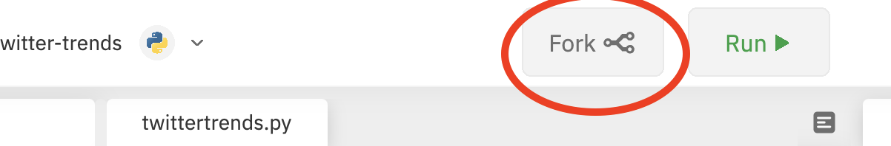

## Twitter Trends :bird:

### Project Description
This project enables you to get the current trending phrases and hashtags people have tweeted by location. It requests a WOEID location ID from the user, which it uses to find trending tweet topics in your area. The worldwide WOEID for example is `1`.

__See this project live at__ https://repl.it/@jessdam/twitter-trends#twittertrends.py

#### Editing the project
_Note: to edit this project in the online environment you'll need a Google, Facebook or GitHub account_

After clicking on the link above, click on the `Fork` button at the top of the page, which will make a copy of the project for you to edit

##

#### Concepts Learned:
- Variables
- Data types
- Dictionaries / Objects
- Method calling
- For loops
- Try/catch statements
- User input and output
- Formatted strings
- Lists

- Libraries
- Tweepy
- Twitter API
- Config files
##

### Intro to Python
Python is a programming language that uses a writing structure similar to English, which make it easier to read than most languages. It’s a great language to begin with when learning how to code, since you can use it for making nearly any type of app, from platform games to artificial intelligence algorithms. For this reason, it’s also commonly-used in large corporations, like at Google, NASA, Netflix and Spotify, to name a few.

#### Installing Python

#### Some Resources for learning Python
- https://www.freecodecamp.org/news/best-python-tutorial/
- https://www.freecodecamp.org/news/the-ultimate-guide-to-python-from-beginner-to-intermediate-to-pro/
- https://realpython.com/start-here/
- https://www.ubuntupit.com/best-python-libraries-and-packages-for-beginners/

